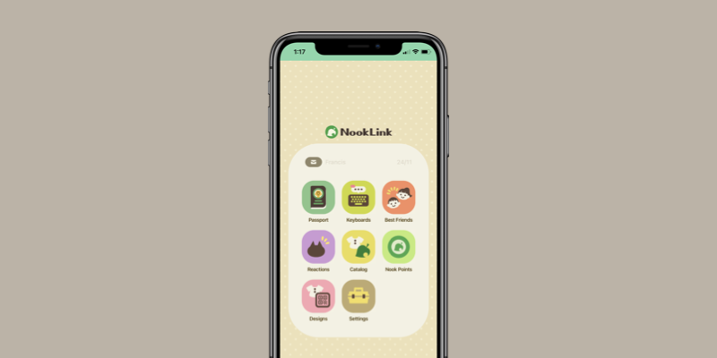

# NookLink Clone

This is the UI clone of NookLink service in the Nintendo Switch Online mobile app.

  

## Image assets

The NookLink logo and app icon images used in this project are retrieved from Nookipedia [NookLink wiki page](https://nookipedia.com/wiki/NookLink), which were extracted from copyrighted source. All the images used belong to their respective owner(s).
